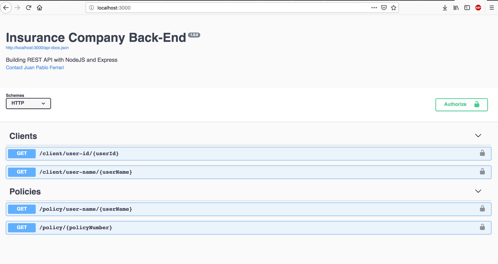
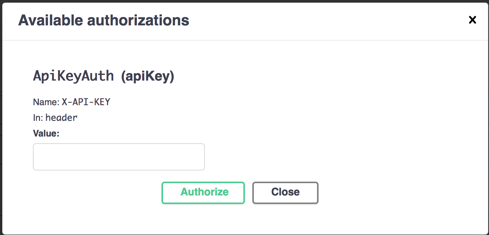

# Back End (Altran)

Se utilizo ExpressJS con NodeJS. Algunas de las features que tiene son:

* [NodeJS](https://nodejs.org)
* [NPM](https://www.npmjs.com)
* [Docker](https://www.docker.com)
* [Express](https://expressjs.com)
* [Swagger](https://swagger.io)
* [Mocha](https://mochajs.org)
* [Chai](https://www.chaijs.com)
* [Supertest](https://github.com/visionmedia/supertest)
* [Istanbul](https://istanbul.js.org)
* [Eslint](https://standardjs.com)
* [Lodash](https://lodash.com)

## Requerimientos

* [NodeJS](https://nodejs.org/en) >= 10
* [Node Version Manager](https://github.com/creationix/nvm) (Opcional)

## Scripts

* `nvm use` para usuar la versión de Node correspondiente (Opcional)
* `npm install` para instalar las dependencias
* `npm debug` para entorno de desarrollo
* `npm start` para producción
* `npm test` para tests unitarios y de integración
* `npm run lint` linter de código

## Swagger




1. Ingresar a http://localhost:3000 para ver documentación con Swagger
2. Ingresar `a4811fx8e88a6x11c78g` en el `X-API-KEY`

## Instalación con Docker

Mirar [Instalación Docker](https://docs.docker.com/install) and [Instalación Docker Compose](https://docs.docker.com/compose/install)

```sh
$ docker-compose build
$ docker-compose up
```
Verifique la implementación navegando a la dirección de su servidor en su navegador preferido.

```sh
http://localhost:3000
```

## Licencia

MIT